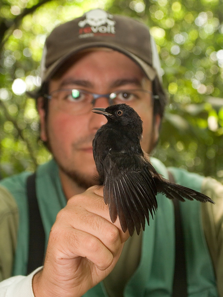

   

#About
<table style = "width:70%">
<tr><td>

 
I am a biologist with a PhD in Ecology. During my academic training I acquired solid skills in scientific research, quantitative analysis and **<a href="https://www.r-project.org/" target="_blank">R</a>** programming. As a professional ornithologist I acquired extensive field experience in the Atlantic forest, Cerrado and Amazon biomes.

My main scientific interests are in population and community ecology, ornithology, data science, conservation biology and chronobiology. I am also interested in philosophy of science and quantitative approaches in general. I support initiatives of free sharing of knowledge, such as open source, free software,  and creative commons licenses.

</td>
<tr><td>
 
</td></tr>
<tr><td>

Scroll down for information about my education, teaching and professional experience. Access my **<a href="http://buscatextual.cnpq.br/buscatextual/visualizacv.do?id=K4779985Y2" target="_blank">CV Lattes here</a>** (in portuguese). 
</td></tr>

</table>

   

#Education

Year | Degree
-----| -------------------------------------------
2017   | **PhD in Ecology** at the University of Sao Paulo. PhD Thesis: [**Population and community dynamics of butterflies and birds along time**](http://www.teses.usp.br/teses/disponiveis/41/41134/tde-12072017-084936/pt-br.php). Held at [The Theorethical Ecology Lab](http://ecologia.ib.usp.br/let/doku.php). Advisor: Prof. Dr. [Paulo Inacio Prado](http://ecologia.ib.usp.br/let/doku.php?id=engl:prado:start). Supported by Coordination for the Improvement of the Higher Level Personnel ([CAPES](www.capes.gov.br)) and Sao Paulo Research Foundation ([FAPESP](www.fapesp.br)).  
2011       | **Master in Ecology** at the University of Sao Paulo. MSc Thesis: [**The conservation value of forest corridors for birds in fragmented landscapes**](http://www.teses.usp.br/teses/disponiveis/41/41134/tde-10052011-155405/pt-br.php). Held at the [Landscape Ecology and Conservation Lab](http://ecologia.ib.usp.br/lepac/index.php?option=com_content&view=article&id=46&Itemid=11). Advisor: Prof. Dr. [Jean Paul Metzger](http://ecologia.ib.usp.br/lepac/index.php?option=com_content&view=category&layout=blog&id=45&Itemid=63). Supported by Coordination for the Improvement of the Higher Level Personnel ([CAPES](www.capes.gov.br)), National Council for Scientific and Technological Development ([CNPq](www.cnpq.gov.br)), and Federal Ministry for Education and Research ([BMBF](https://www.bmbf.de/en/index.html) - Germany).  
2004  | **Bachelor in Biology** at the University of Sao Paulo. Monography: Effects of forest fragmentation on artificial nests predation. Supported by Sao Paulo Research Foundation ([FAPESP](www.fapesp.br)).
2003 | **Internship at the Biological Dynamics of Forest Fragments Project** ([BDFFP](http://pdbff.inpa.gov.br/) – [INPA](www.inpa.gov.br)/[Smithsonian Institution](http://www.stri.si.edu/)) in the program Training for Young Scientists in Amazon. Monography: Polination aspects of Psychotria iodotrichia (Rubiaceae) in primary and secondary forests in central Amazon. Supported by the World Wildlife Fund (WWF) and the State University of New York (SUNY).
    

#Teaching experience

Year | Experience
-----------|--------------------------------------
2016 & 2017| Lecturer in the course **[Field Ornithology - Birds as bioindicators](https://ornitologiadecampobutantan.wordpress.com/)** at the [Instituto Butantan](www.butantan.gov.br), Brazil. Lectures given: **Methods for the study of populations and communities**, **Introduction to radiotracking**, and **Data analysis**.
2009 to 2017 | Invited lecturer in the course **<a href="http://buscatextual.cnpq.br/buscatextual/visualizacv.do?id=K4779985Y2" target="_blank">BIZ0304 - Diversity, natural history, and conservation of vertebrates in South America</a>** (undergraduate level - Biological Sciences) at the University of Sao Paulo. Participation in the lecture **Techniques for studying birds in the field**.
2016 | Teaching assistant (monitor - PAE) in the course **BIE 0320 - Ecology of plant populations and communities** (undergraduate level - Biological Sciences) at the University of Sao Paulo.
2015 | Invicted lecturer at the course **BIE5730 - Statistical models in population ecology** (graduate level - Ecology) at the University of Sao Paulo. Lecture given: **Using RMark for capture-recapture data analysis**.
  

#Awards
<table style="width:70%">  
<tr><td>
* **Best Master thesis** defended in 2011 in the Ecology Graduate Program, Institute of Biosciences, University of São Paulo.

* **Helmut Sick Award** - Best poster presentation at the XII Brazilian Ornithology Congress.

* **Helmut Sick Award** - Second best poster presentation at the XV Brazilian Ornithology Congress.
</td><tr>
</table>
  

#Selected professional experiences  

<table style="width:70%">  
<tr><td>
* Technical coordinator in **Bird monitoring in primary forest, selective-logged forest and eucalyptus plantations in the Jari river valley, Amazon, Brazil**. Client: Jari Celulose S.A. Consulting company: Ambiens Soluções Ambientais.

* Technical coordinator in **Bird monitoring around the São Sebastião Port, São Paulo, Brazil**. Client: CODESP. Consulting company: Ambiens Soluções Ambientais & FUNDESPA.

* Technical coordinator in **Birds, mammals, reptiles and anphibians in reforested areas around Três Irmãos power plant dam, São Paulo, Brazil**. Client: Tijoá Energia S.A. Consulting Company: Ambiens Soluções Ambientais.

* Technical coordinator in **Bird inventories for the Environmental Impact Assesment of the widening of the BR-101 highway, Espirito Santo, Brasil**. Client: Eco 101. Conculting company: Concremat & Ambiens Soluções Ambientais.

* Technical coordinator in **Bird monitoring in the Juruena power plants complex. Mato Grosso, Brazil**. Client: Juruena Participações e Investimentos S.A. & Maggi Energia. Consulting company: JGP Consultoria e Participações Ltda.
</td></tr>
</table>

