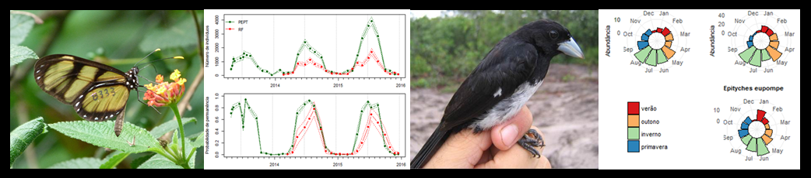

  

<table style="width:70%">
<tr>
<td>

##Carlos Candia-Gallardo, PhD.

Welcome to my website. I am a biologist investigating bird and butterfly ecology. I created this website to summarize my research and teaching activities. Check out my posts about biodiversity data analysis using R.

</td>
</tr>
<tr>
<td>
 
 <td><tr>
<tr>
<td>

</td>
</tr>
<tr>
<td>
  

 **<a href = "about.html">About</a>** **|** **<a href = "publications.html">Publications</a>** **|** **<a href = "posts.html">Posts</a>** 
</td></tr>       
</table>

