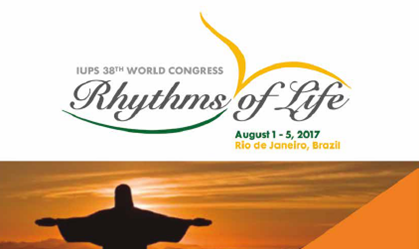
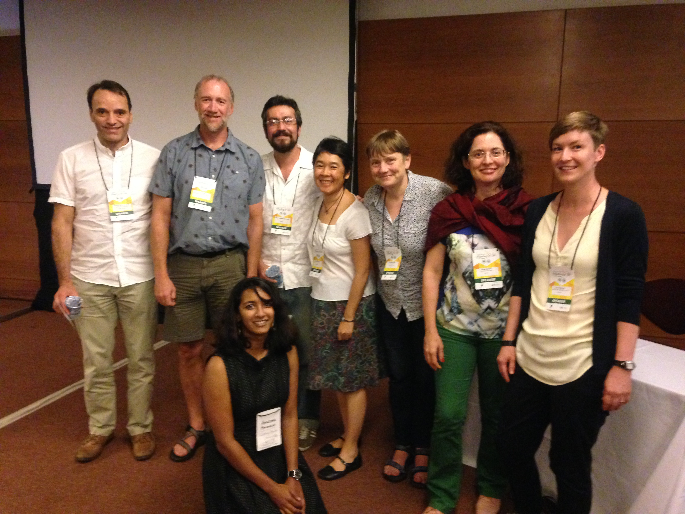

<table style = "width:85%">
<tr><td>
#Research on Ithomiini butterflies presented at the 38th IUPS
####Carlos Candia-Gallardo
####17th September 2017
</td></tr> </table>

<table style = "width:85%">
<tr><td>

In August 2017 I had the honour to participate in the symposium **Wild clocks: Temporal organization of physiology and behavior in natural settings** during the **38th World Congress of the International Union of Physiological Sciences** held in Rio de Janeiro, Brazil.  

It was a great opportunity to meet outstanding reseachers of the field of chronobiology that study organisms as different as rodents, birds and humans. I presented part of my PhD research about regulation of seasonal strategies in Ithomiini butterflies in face of climate changes (the article is coming soon). 

</td></tr> </table>

 

The participants of the symposia were: 

* Barbara Helm (UK): **Temporal multitasking: programs and plasticity of migratory birds on different time scales**.  

* Horacio De La Iglesia (USA): **Sleep Under “Natural” Conditions** 

* Carlos Candia-Gallardo (Brazil): **Adaptative responses in changing environments: annual cycles of butterflies during atypical rainfall regimes** 

* Gisele A. Oda (Chair – Brazil) - **Daily and annual photic synchronization in a subterranean rodent**
   

<a href="http://candiagallardo.github.io/posts.html" class="btn btn-primary btn-lg">Back to posts</a>

   

